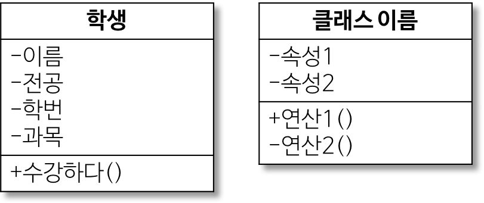

# Design Pettern

참고서적 Head First Design Patterns

Java 기반으로 설명을 하고 있어서
Go 언어로도 패턴이 구현이 가능한지 같이 공부하면서 예제코드도 생성

간단한 용어도 다시한번 정리 해놓기

## Class Diagram

관계설정 그리고 디자인 패턴을 적용하게 되는데 이것을 다른 언어에서도 적용하기 위해서는 일반적인 표기인 클래스 다이어그램을 이용해서 하면 이 다이어그램 하나로도 다른 언어에 맞게 적용시킬수 있어서 표기 방법을 정리해보자

혹시나 다른 언어에는 없을수 있는 추상에 관련된건 제외 시켜버렸다.

-   가장 윗부분 : 클래스 이름
-   중간 부분 : 속성 ( 맴버 변수? )
-   마지막 부분 : 연산 ( 매서드? )

ex)

| 접근 제어자 | 표시 | 설명                                                                               |
| :---------: | :--: | :--------------------------------------------------------------------------------- |
|   public    |  +   | 어떤 클래스의 객체에서든 접근 가능                                                 |
|   private   |  -   | 이 클래스에서 생성된 객체들만 접근 가능                                            |
|  protected  |  #   | 이 클래스와 동일 패키지에 있거나 상속 관계이 있는 하위 클래스의 객체들만 접근 가능 |
|   package   |  ~   | 동일 패키지에 있는 클래스의 객체들만 접근 가능                                     |

> Java에서도 package 접근 제어자가 사용되는지는 잘 모르겠다

> Go에서는 protected는 사용되지 않는것으로 보인다.

> 즉 언어에 맞게 적절히 변경은 조금씩 필요한듯 보입니다.

## - 연관 관계

|    관계     |       표시       | 설명                                                                                                 |
| :---------: | :--------------: | :--------------------------------------------------------------------------------------------------- |
|  연관 관계  | 실선이나 화살표  | 클래스들이 개년상 서로 연결되었음                                                                    |
| 일반화 관계 |  속이빈 화살표   | 객체지향 개념에서는 상속관계. 한 클래스가 다른 클래스를 포함하는 상위 개념일때                       |
|  의존 관계  |   점선 화살표    | 연관관계와 같이 한클래스가 다른 클래스에서 제공하는 기능을 사용할 때를 나타냄. 매우짧은 시간만 유지? |
| 실체화 관계 | 빈 삼각형과 점선 | 인터페이스 클래스를 실현한 클래스들 사이의 관계                                                      |
