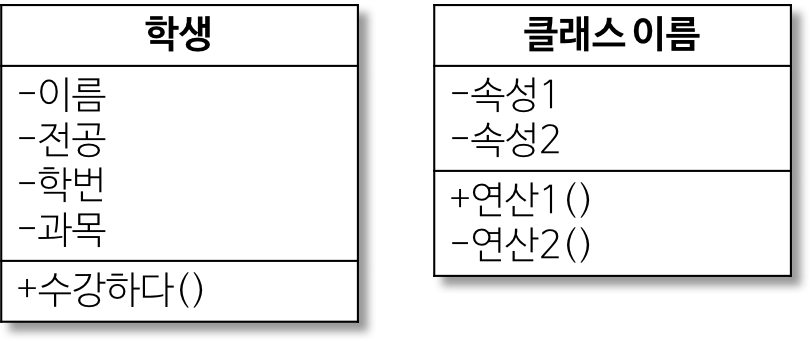

# UML 정리
## - Unified Modeling Language
- 프로그램 설계를 표현하기 위해 사용하는 표기법
- 모델링 언어로 프로그래밍 언어나 개발 공정에 종속되지 않아야 한다!
- 작성 목적은 객체지향 시스템을 가시화, 명세화, 문서화
- 협동, 프레임워크, 패턴, 컴포넌트 등의 고수준의 개발 개녕들을 지원 -> 이런걸 가시화 하고 문서화 하는 언어라고 생각하면 될듯

## - UML 특징
- 가시화 언어 
- 명세화 언어
- 구축 언어 : 다양한 언어의 소스스코드로 변환하여 구축 할 수 있다
- 문서화 언어

대략 이정도만 하고 지금은 사용하고 싶은 클래스 다이어 그램을 알아보자

## - UML 다이어그램 종류
- Structure Diagram : 정적이고, 주고 표현을 위한 다이어그램
- Behavior Diagram : 동적이고, 시퀀셜한 표현을 위한 다이어그램

-> 결국 하고싶은 얘기는 Class Diagram은 Structure Diagram에 속한다!

-   가장 윗부분 : 클래스 이름
-   중간 부분 : 속성, 맴버 변수
-   마지막 부분 : 연산, 매서드

ex)

| 접근 제어자 | 표시 | 설명                                                                               |
| :---------: | :--: | :--------------------------------------------------------------------------------- |
|   public    |  +   | 어떤 클래스의 객체에서든 접근 가능                                                 |
|   private   |  -   | 이 클래스에서 생성된 객체들만 접근 가능                                            |
|  protected  |  #   | 이 클래스와 동일 패키지에 있거나 상속 관계이 있는 하위 클래스의 객체들만 접근 가능 |
|   package   |  ~   | 동일 패키지에 있는 클래스의 객체들만 접근 가능                                     |

> Java에서도 package 접근 제어자가 같이 되는게 있는지 모르겠다...

> Go에서는 protected는 없는 개념?인듯...

> 즉 언어에 맞게 적절히 변경은 조금씩 필요한듯 보입니다.

## - 연관 관계

|    관계     |       표시       | 설명                                                                                                 |
| :---------: | :--------------: | :--------------------------------------------------------------------------------------------------- |
|  연관 관계  | 실선이나 화살표  | 클래스들이 개년상 서로 연결되었음                                                                    |
| 일반화 관계 |  속이빈 화살표   | 객체지향 개념에서는 상속관계. 한 클래스가 다른 클래스를 포함하는 상위 개념일때                       |
|  의존 관계  |   점선 화살표    | 연관관계와 같이 한클래스가 다른 클래스에서 제공하는 기능을 사용할 때를 나타냄. 매우짧은 시간만 유지? |
| 실체화 관계 | 빈 삼각형과 점선 | 인터페이스 클래스를 실현한 클래스들 사이의 관계                                                      |

